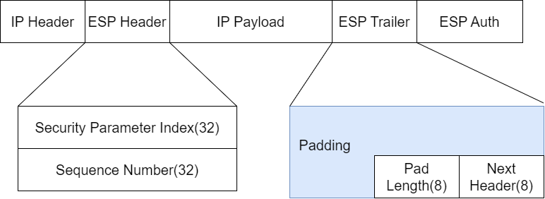
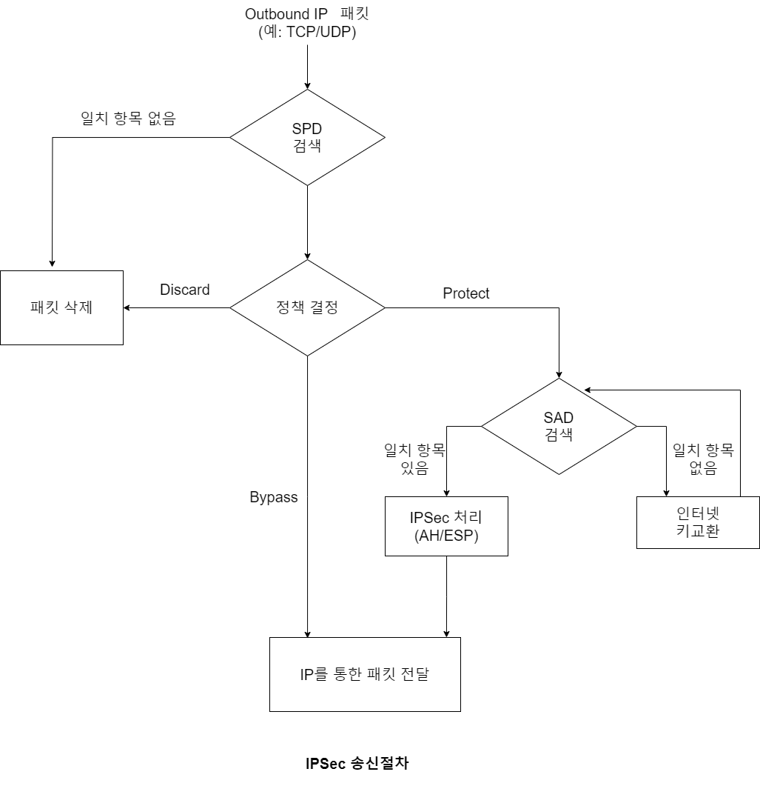
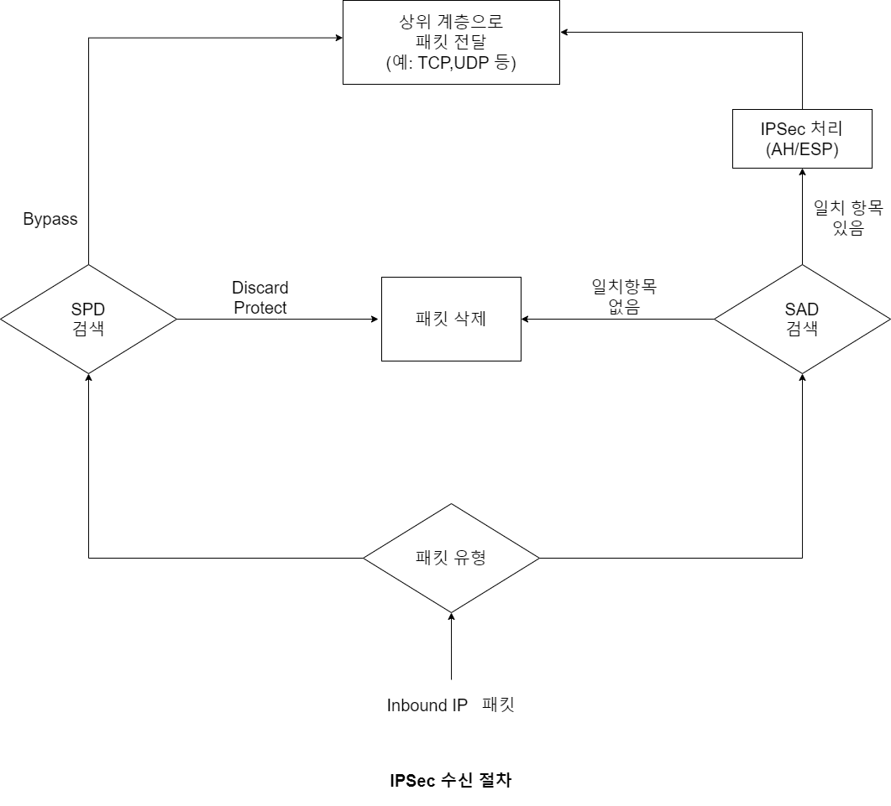

# 102.IPSec

## IPsec

* IETF(국제 인터넷 기술 위원회)에서 IP보안을 위하여 개방형 구조로 설계한 표준으로 IP(네트워크) 계층 보안에 대해서 안정적이고 표준화된 기초를 제공한다.
* 종단 노드 구간(End Point) 또는 보안/터널 게이트웨이 구간에 IP 패킷 보안 서비스를 제공해주는 네트워크 계층 보안 프로토콜
* IP 계층에서 직접 보안 서비스를 제공합에 따라 상위 계층 프로그램의 변경이 필요하지 않다.
* 차세대 인터넷 프로토콜인 IPv6에서 IPsec을 기본적으로 포함하고 있다.

\
\

## 보안 서비스 제공(RFC2401 표준 정의)

1. 기밀성(Confidentiality)
   * 메시지가 제3자에 의해 도청되어도 그 내용을 알 수 없음을 보장해준다.
   * 대칭 암호화를 통해 기밀성을 제공해준다. 단, **AH 프로코톨은 암호화를 지원하지 않으며 ESP프로토콜만 암호화를 지원한다.**
2. 비연결형 무결성(Connectionless Intergrity)
   * 메시지가 위/변조 되지 않았음을 보장해준다.
   * 메시지 인증 코드를 통해 각 IP 패킷별로(순서에 상관없이) 무결성을 보장해준다.
   * 송신 측에서 인증 데이터(Authentication Data)
3. 데이터 원청 인증/송신처 인증(Data Origin Authentication)/MAC 값을 계산하여 전송하고 수신측에서 이를 검증한다.
   * 수신한 메시지가 올바른 송신처로부터 온 것임을 보장해준다.
   * 메시지 인증 코드(MAC)를 통해 IP 패킷이 올바른 송신처로부터 온 것임을 보장해준다.
4. 재전송 공격 방지(Protection Againt Replays)
   * 송신 측에서 IP 패킷별로 순서번호(Sequence Number)를 전송하고 수신 측에서 해당 보안연관(SA:Security Association)에 순서번호를 유지하고 이를 검증하여 재전송 공격을 방지한다.
5. 접근 제어(Access Contorl)
   * 보안정책(SP:Security Policy)을 통해 송수신 IP 패킷에 대한 시스템 접근을 제어한다.
   * 접근 제어 방식은 IP 패킷의 허용(Bypass), 폐기(Discard), 보호(Protect,IPsec 적용) 등이 있다.
6. 제한된 트래픽 흐름의 기밀성(Limited Traffic Flow Confidentiality)
   * 트래픽 흐름이란 해당 패킷이 어디에서 출발해서 어디를 목적지로 향해 가능지에 대한 정보를 말한다.
   * ESP/터널모드의 경우 New IP헤더를 통해 터널/보안 게이트웨이 구간의 트래픽 흐름 정보는 노출되지만, 원본 IP 해더는 암호화되어 있기 때문에 터널/보안 게이트웨이의 종단 노드 구간의 트랙픽 흐름의 기밀성은 보장된다.

\
\

## IPSec 동작 모드

\
\

#### 전송모드

|            |           |                  |            |                   |   |
| ---------- | --------- | ---------------- | ---------- | ----------------- | - |
| 원본 IP 패킷   |           | IP Header        | IP Payload |                   |   |
| IPSec 전송모드 | IP Header | **IPSec Header** | IP Payload | **IPSec Trailer** |   |

* IP 패킷의 페이로드를 보호하는 모드, 즉 IP의 상위 프로토콜 데이터를 보호하는 모드
* IP 패킷의 페이로드만 IPSec으로 캡슐화하고 IP 헤더는 그대로 유지하므로 네트워크 상 패킷 전송에는 문제가 발생하지 않는다.
* IP 헤더를 보호하지 않기 때문에 트래픽 흐름(최초 출발지 및 최종 목적지)이 분석될 수 있다.
* 일반적으로 종단 노드 구간의 IP 패킷 보호를 위해 사용한다.

\
\

#### 터널모드

|            |                   |                  |                  |            |                   |   |
| ---------- | ----------------- | ---------------- | ---------------- | ---------- | ----------------- | - |
| 원본 IP 패킷   |                   | IP Header        | IP Payload       |            |                   |   |
| IPSec 전송모드 | **New IP Header** | **IPSec Header** | Origin IP Header | IP Payload | **IPSec Trailer** |   |

* IP 패킷의 전체를 보호하는 모드
* IP 패킷 전체를 IPSec으로 캡슐화하여 IP 헤더를 식별할 수 없기 때문에 네트워크 상 패킷 전송이 불가하다. 따라서 전송구간 주소를 담은 New IP 헤더를 추가한다.
* 원본 IP 헤더를 보호하기 때문에 최초 출발지 및 최종 목적지에 대한 트래픽 정보의 기밀성을 보장해준다. 단, 새로운 IP 헤더를 통해 보안/터널 게이트웨이 구간 정보는 노출될 수 있기 때문에 "제한적 트래픽 흐름의 기밀성을 보장해준다"라고 한다.
* 일반적으로 터널/보안 게이트웨이 구간 또는 종단 노드와 터널/보안 게이트웨이 구간의 IP 패킷 보호를 위해 사용한다.
* 터널/보안 게이트웨이 구간 IP 패킷 보호는 물리적으로 떨어진 위치의 본ㆍ지점 사이에 다수의 사용자 호스트와 서버로 구선된 VPN 환경을 예를 들 수 있다.
* 종단 노드와 터널/보안 게이트웨이 구간 IP 패킷 보호는 외부 사용자 호스트와 본ㆍ지점 사이의 VPN 환경 구성을 예를 들 수 있다. 이 경우 외부 사용자 호스트는 VPN
* 클라이언트 프로그램이 필요하다.

\
\

## AH 프로토콜

|           |           |            |
| --------- | --------- | ---------- |
| IP Header | AH Header | IP Payload |

* AH 프로토콜은 메시지 인증코드(MAC)를 사용하여 인증(무결성과 송신처 인증)을 제공해주는 프로토콜로 기밀성은 제공하지 않는다.
* 송신 측에서 MAC 알고리즘과 인증키를 통한 인증 데이터를 계산하여 전송하고 수신 측에서 이를 검증한다. 인증 데이터 계산에는 IP 헤더의 변경 가능한 필드를 제외한 IP 패킷 전체를 대상으로 한다.
* 동적으로 변경되는 필드를 인증 데이터 계산에 포함할 경우 수신 측 검증 시 인증데이터가 일치하지 않아 인증에 실패하므로 변경되는 필드를 제외하고 인증 데이터를 계산한다.
* IP 헤더의 전송 중 변경 가능한 필드는 TTL(Time To Live), Header Checksum, NAT 환경에서의 Source IP 등이 있다.
* AH 프로토콜은 암호화를 지원하지 않기 때문에 ICMP 메시지기 평문으로 전송된다.

\
\

#### AH Header 정보

|                |                                                         |              |
| -------------- | :-----------------------------------------------------: | ------------ |
| Next Header(8) |                    Payload Length(8)                    | Reserved(16) |
|                |               Security Parameter Index(32)              |              |
|                |                   Sequence Number(32)                   |              |
|                | 
Authentication Data(Digest) (Variable Length)
 |              |

* SPI : 현재 연결에 대한 보안연관(SA) 식별자.
* 순서번호: 재전송 공격을 방지하기 위한 필드로 정상적인 환경에서는 패킷 전송이 발생해도 일련 번호는 항상 1씩 증가하기 때문에 재전송 공격을 방지할 수 있다.
* 인증데이터: IP 헤더의 변경이 가능한 필드를 제외한 IP 패킷 전체에 대한 MAC 값( 또는 ICV)을 설정한다.

\
\

#### AH프로토콜 동작모드

|      |                   |               |                      |            |   |   |
| ---- | ----------------- | ------------- | -------------------- | ---------- | - | - |
| 전송모드 |                   | IP Header     | **AH Header**        | IP Payload |   |   |
| 터널모드 | **New IP Header** | **AH Header** | **Origin IP Header** | IP Payload |   |   |

* 전송모드는 IP 헤더의 전송 중 변경 가능한 필드를 제외한 IP 패킷 전체를 인증한다.
* 터널모드는 New IP 헤더의 전송 중 변경이 가능한 필드를 제외한 New IP 패킷 전체를 인증한다.

\
\

## ESP(Encapsulating Security Payload) 프로토콜

* ESP 프로토콜은 메시지 인증 코드(MAC)와 함께 암호화를 이용하여 인증(무결성과 송신처 인증과 기밀성)을 제공한다.
* 인증과 암호화를 선택적으로 적용할 수 있따. 즉, 인증만 적용하거나 인증+암호화를 적용할 수 있다.
* 인증에 있어서 AH 프로토콜과의 차이점은 AH는 변경 가능한 IP 헤더 필드를 제외한 IP 패킷 전체를 인증하지만 ESP는 IP헤더를 인증하지 않는다.
* ESP 프로토콜은 암호화를 지원하기 떄문에 ICMP 메시지가 암호화되어 전송된다.

**ESP 헤더**

* SPI: 현재 연결에 대한 보안연관(SA) 식별자
* 일련번호: 재전송 공격을 방지하기 위한 필드로 정상적인 환경에서는 패킷 재전송이 발생해도 일련번호는 항상 1씩 증가하기 때문에 재전송 공격을 방지할 수 있다.

\
\

**ESP 트레일러**

* 블록 암호를 위한 패딩 정보와 전송하는 페이로드의 프로토콜 타입(Next Header) 정보를 담고 있다.

\
\

**ESP Auth**

* 인증 데이터 정보를 저장한다.

#### ESP 프로토콜 동작 모드

**ESP 프로토콜 전송모드**\

* 전송모드는 IP 페이로드와 ESP 트레일러를 암호화하고 암호화된 데이터와 ESP 헤더를 인증한다.

\

**ESP 프로토콜 터널모드**\

* 터널 모드는 원본 IP 패킷 전체와 ESP 트레일러를 암호화하고 암호화된 데이터와 ESP 헤더를 인증한다.

\
\

## SA(Security Association)와 SP(Security Policy)

#### 보안연관(SA)

* 둘 사이에 논린적인 연결 상태를 유지하는 동안 적용할 보안 설정 정보를 "보안 연관(SA)"이라 한다.
* 보안연관(SA)은 단방향성/일방향성을 갖기 때문에 대상 호스트와 송수신을 모두 하려면 2개의 보안 연관이 필요하다. 예를 들어, A호스트와 B호스트가 송수신한다면 A->B를 위한 보안연관과 B->A를 위한 보안연관이 필요하다.
* 여러 보안 연관을 저장해놓은 데이터베이스를 보안연관 데이터베이스(SAD)라 한다.
* 보안연관 주요 항목
  * SPI(Security Parameter Index): 보안 연관 식별자
  * Sequence Number Counter: 패킷의 순서번호 카운터
  * Anti-Replay Window: Replay-Attack을 방어하기 위한 윈도우 값
  * AH/ESP 정보: AH 및 ESP 프로토콜 정보 (MAC 알고리즘, 대칭키 알고리즘, 관련 키 정보)
  * Lifetime: 세션 만료 기간
  * Mode: IPsec 동작모드(전송 모드, 터널 모드)
  * Path MTU: 경로의 MTU 값

\

#### 보안정책(SP)

* 패킷을 송신하거나 수신했을 때 적용할 보안의 종류를 정의하는 것을 보안정책이라 한다.
* 일반적인 보안 정책에는 IP 패킷을 허용하거나(Bypass), 폐기하거나(Discard), IPsec 적용(Protect) 등이 있다.
* 이러한 보안 정책을 저장해 놓은 데이터베이스를 보안 정책 데이터베이스(SPD)라 한다.

## IPSec 송신절차

1. 전송할 패킷에 대해서 보안정책데이터베이스(SPD)를 검색한다.
2. SPD에 일치하는 엔트리가 없으면 패킷을 삭제한다.
3. SPD에 일치하는 엔트리가 있으면 첫 번쨰 엔트리의 정책에 따라 처리한다.
   * 정책이 폐기(Discard)라면 해당 패킷을 삭제한다.
   * 정책이 허용(Bypass)라면 해당 패킷을 송신한다.
   * 정책이 보호(Protect)라면 보안 연관 데이터베이스(SAD)를 검색한다.
4. 보안 연관 데이터베이스(SAD)에 일치하는 엔트리가 있으면 IPSec 처리를 수행한 후 전송하고, 일치하는 엔트리가 없으면 인터넷 키 교환(IKE)과정을 수행하여 SA를 생성하는 과정을 수행한다.

\
\

## IPSec 수신절차

1. IP 프로토콜의 protocol 필드를 조사하여 보호되지 않는 IP 패킷인지 IPSec(AH/ESP) 패킷인지 확인한다.
2. 보호되지 않는 IP 패킷이라면 보안 정책 데이터베이스(SPD)를 검색하고 첫 번째 일치하는 엔트리가 허용(Bypass)정책이면 상위 계층으로 전달하고, 폐기(Discard) 또는 보호(Protect)라면 패킷을 삭제한다.
3. IPSec 패킷이라면 보안 연관 데이터베이스(SAD)를 검색하여 일치하는 엔트리가 없으면 패킷을 삭제하고 일치하는 엔트리가 있으면 IPSec처리를 수행한 후 상위 계층으로 전달한다.

\
\

## 인터넷 키교환(IKE: Internet Key Exchange) 프로토콜

* 보안 관련 설정을 생성, 협상 및 관리하는 프로토콜로 500/udp 포트 사용
* IPsec에서 양 당사자 간의 논리적인 연결정보 및 보안 설정을 보안연관(SA)이라 한다.

1. IKE 1단계(phase 1)
   * IKE 2단계(phase 2)에서 사용할 메시지들을 어떻게 보호할 것인지를 협상하는 단계로 이 과정을 통해 IKE용 마스터키를 생성한다.
   * 이 단계를 통해 생성된 보안연관(SA)을 "IKE SA"라고 하고, 양방향성(송수신 모두 이용)을 가진다. 다음 2가지 중 1가지 모드로 구현한다.
     * Main Mode: 3쌍의 메시지(6개의 메시지)를 교환하는 방식으로(기본 모드) Aggressive Mode에 비해 단계가 많지만, 세션 ID를 암호화하기 때문에 보안성이 높다.
     * Aggressive Mode: Main Mode보다 빠른 버전으로 3쌍의 메시지가 아닌 3개의 메시지를 교환하는 방식이다. 협상을 빠르게 할 수 있지만 세션 ID를 암호화하지 않기 때문에 보안성이 낮다.\

2. IKE 2단계(phase 2)
   * 2단계는 실질적인 데이터를 어떤 방식으로 보호할 것인지를 협상하는 단계로 이 단계를 통해 생성된 보안연관(SA)을 "IPSec SA" 라고 한다.
   * 1단계를 통해 생성된 키를 이용해 메시지가 보호되며 Quick Mode를 통해 구현한다.
     * 3번의 메시지교환을 통해 IPSec 통신을 위한 보안연관 및 키협상이 이루어진다.
     * 이때 생성되는 보안연관(SA)은 단방향성을 가진다. 따라서 수신용 SA와 송신용 SA가 생성된다.
