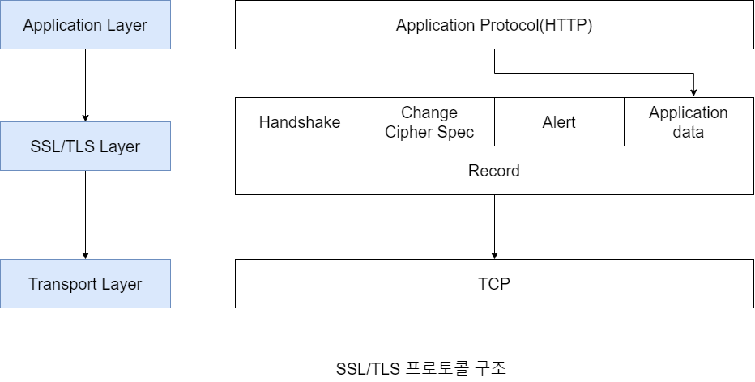

# 103.SSL\_TLS

## 전송 계층 보안 - SSL/TLS

* SSL은 1994sus Netscape사의 웹 브라우저를 위한 보안 프로토콜로 처음 제안되어 1996년 SSL3.0 버전까지 발표
* 1999년 IETF(국제 인터넷 표준 기구)에서 SSL3.0을 기반으로 표준화시킨 TLS1.0을 발표, 현재 TLS1.2 버전까지 널리 사용되고 있음.
* SSL/TLS는 클라이언트/서버 환경에서 TCP기반의 Application에 대한 종단간 보안 서비스를 제공하기 위해 만들어진 전송계층 보안 프로토콜이다.
  * 전송계층(TCP)과 애플리케이션 계층 사이에서 동작한다. 다양한 TCP 기반 애플리케이션 프로토콜에 보안 서비스를 제공한다.
  * 각 애플리케이션 프로토콜이 SSL을 이용할 경우 이를 구분하기 위해 고유한 well-known 포트를 할당.\
    https(443/tcp), smtps(465/tcp), ftps(990/tcp), telents(992/tcp) 등

## 보안 서비스 제공

* 기밀성: 대칭 암호를 이용한 송수신 메시지 암호화를 통해 기밀성을 제공한다.
* 무결성: 메시지 인증 코드(MAC)를 통해 송수신 메시지의 위,변조 여부를 확인할 수 있는 무결성을 제공한다.
* 인증: 공개키 인증서를 이용한 서버/클라이언트 간 상호 인증을 수행

\
\

## SSL/TLS 프로토콜 구조

* SSL/TLS는 크게 2계층으로 이루어진 프로토콜이다.
  * 상위계층: Handshake, Change Cipher Spec, Alert, Application Data 프로토콜로 구성
  * 하위계층: Record 프로토콜
* 세부 프로토콜의 기능
  1. Handshake 프로토콜: 종단 간에 보안 파라미터를 협상하기 위한 프로토콜
  2. Change Cipher Spec 프로토콜: 종단 간에 협상된 보안 파라미터를 이후부터 적용/변경함을 알리기 위한 프로토콜
  3. Alert 프로토콜: SSL/TLS 통신 과정에서 발생하는 오류를 통보하기 위한 프로토콜
  4. Application Data 프로토콜: Application 계층의 데이터를 전달하기 위한 프로토콜
  5. Record 프로토콜: 적용/변경된 보안 파라미터를 이용하여 실제 암호화/복호화, 무결성 보호, 압축/압출해제 등의 기능을 제공하는 프로토콜
*   상태유지 프로토콜

    1. 세션(Session)과 연결(Connection) 기반의 상태 유지 프로토콜이다.
       * 완전 협상을 통해 세션을 생성하고, 이 세션 정보를 공유하는 다수의 연결을 단축협상을 통해 생성한다.
    2. 세션 상태 정보
       * 양 종단 간에 완전 협상을 통해 생성되는 상태정보로 세션이 유지되는 동안에 지속적으로 다수의 연결에 의해 사용되는 보안 파라미터 정보가 관리된다.
       * 대표적인 상태정보로 다수 연결이 사용할 "대칭 암호 알고리즘", "HMAC용 해시 알고리즘" 등이 있다. |필드|설명| |--|--| |session ID|둘 사이의 세션 식별자, 32 바이트로 구성| |peer certificate|상대방의 인증서(X.509v3)| |cipher spec\
         (암호명세)|암호 명세로 다음과 같은 정보를 담고 있다. <> \* 대칭 암호 알고리즘, 키 길이, 블럭 암호 모드 등 <> \* HMAC용 해시 알고리즘| |compression method|압축 방식, 현재는 null만 정의| |master secret|\* 키 블럭을 생성하기 위해 서버와 클라이언트가 공유하는 48바이트 비밀값\
         \* 완전 협상을 통해 생성한 premaster secret, server random, client random을 조합/해시하여 master secret를 생성한다.\
         \* server random, client random은 master secret를 생성하기 위한 salt 역할을 수행한다.| |is resumable|현재 세션이 재사용 될 수 있는지 여부 플래그, 재사용 된다는 의미는 여러 연결에 의해 다시 사용될 수 있는가 하는 의미|
    3. SSL/TSL 연결 상태(Connection State)정보
       * 실제 통신이 이루어지는(데이터 송수신) 단위로 단축 협상을 통해 생성되며 세션 상태를 공유하면서 통신을 수행한다.
       * 대표적인 상태정보로 암호키, 인증키 등이 있다.

    | 필드                                       | 설명                                                                                                                                                                                                                                       |
    | ---------------------------------------- | ---------------------------------------------------------------------------------------------------------------------------------------------------------------------------------------------------------------------------------------- |
    | 
server/client random
           | 
- 단축 협상을 통해 서버/클라이언트가 생성한 32바이트 난수 값 - 세션에 저장된 master secret와 단축 협상을 통해 생성된 client random, server random을 조합/해시하여 키 블럭(Key Block)을 생성한 후 이를 이용하여 다양한 키를 만들어낸다. - server random, client random은 키 블럭을 생성하기 위한 salt 역할을 수행한다.
 |
    | 
server/client write key
        | 서버/클라이언트가 암호화에 사용하는 비밀키                                                                                                                                                                                                                  |
    | 
server/client write MAC secret
 | 서버/클라이언트가 메시지 인증코드(MAC)생성 시 사용하는 인증키                                                                                                                                                                                                     |
    | 
server/client write iv
         | 서버/클라이언트가 블록 암호모드에 사용하는 IV(Initialize Vector)                                                                                                                                                                                            |
    | sequence number                          | 전송 메시지 순번                                                                                                                                                                                                                                |

    4. 세션 상태정보와 연결 상태 정보를 이용한 키 생성 과정

    

    

    

    * 완전 협상을 통해 주고받은 사전 마스터 비밀(Premaster Secert), Client Random, Server Random을 조합하여 해시한 결과로 마스터 비밀(Master Secret)을 생성한다.
    * 생성한 Master Secret는 다수 연결이 이용할 수 있도록 세션 상태에 저장된다.
    * 단축 협상을 통해 주고 받은 Client Random, Server Random과 세션에 저장된 Master Secret를 조합하여 해시한 결과로 키블럭(Key Block)을 생성한다.
    * Key Block으로부터 서버/클라이언트 각각의 암호용 비밀키, MAC용 인증키, 블럭 암호 모드용 IV를 계산한다.

## 완전 협상 과정 (Handshake 프로토콜)

1. (Client → Server) **Client Hello 메시지**
   * 클라이어트가 지원 가능한 SSL/TLS 버전, 암호 도구 목록(cipher suites), 압축 방식 등을 서버에 전달하는 메시지
   * 클라이언트 랜덤(Client Random)
     * 클라이언트가 생성하는 32비트 난수값(임의의 난수 28바이트 + 현재 날짜 및 시간 4바이트)으로 "master secret" 및 "키블럭" 생성 시 솔트(Salt)역할을 한다.
   * 세션 ID
     * 서버 측에서 부여하는 ID
     * 서버 세션을 식별하기 위한 ID로 클라이언트가 처음 세션을 생성할 때에는(완전협상) 빈값을 전달하고 이미 생성된 세션을 재사용할 때는 (단축협상) 세션 ID를 담아서 전달한다.
   * 암호 도구 목록(Cipher suites)
     * 클라이언트에서 지원 가능한 암호 도구들에 대한 정보를 담아서 보낸다.
     * 암호도구는 "키 교환 및 인증 알고리즘", "암호 명세"로 구성되어 있다.\
       (형식) _SSL/TLS(A)\_WITH\_(B)_\_ : A는 키 교환 알고리즘, B는 cipher spec
     * 예) **TLS\_RSA\_WITH\_AES\_256\_CBC\_SHA256** : 키 교환 및 인증 알고리즘으로 RSA를 사용하고, 대칭 암호 알고리즘으로 AES를 사용하며 암호키 길이는 256비트, 블록 암호 모드는 CBC이고, HMAC용 해시 알고리즘은 SHA\_256을 사용
     * 예) **TLS\_DHE\_DSS\_WITH\_AES\_256\_GCM\_SHA256** : 키 교환 및 인증 알고리즘으로 DHE, 인증/서명 알고리즘으로 DSS를 사용하고, 대칭 암호 알고리즘으로 AES를 사용하며 암호키 길이는 256비트, 블록 암호 모드는 GCM이고, HMAC용 해시 알고리즘은 SHA\_256을 사용\

2. (Server → Client) **Server Hello 메시지**
   * 사용할 SSL/TLS 버전, 암호도구(cipher suite), 압축방식 등을 클라이언트에게 전달하는 메시지
   * 서버 랜덤(Server Random)
     * 서버가 생성하는 32바이트 난수값(임의 난수 28바이트 + 현재 날짜 및 시간 4바이트)으로 "master secret" 및 "키블럭" 생성 시 솔트(Salt)역할을 한다.
     * 세션ID
       * 새롭게 생성하거나 존재하는 세션 ID 정보\

3. (Server → Client) **Server Certificate\* 메시지**
   * 필요시 서버 인증서 목록(서버 인증서 및 인증서에 서명한 인증기관들의 인증서 목록)을 클라이언트에 전달하는 메시지\

4. (Server → Client) **Server Key Exchange\* 메시지**
   * 필요시 키 교환에 필요한 정보를 전달하는 메시지
     * 키 교환 알고리즘으로 Ephemeral Diffie-Hellman을 사용한다면 공개 Diffie-Hellman 매개변수 (소수 p, 원시근 g, 서버 Diffie-Hellman 공개키)를 서명 알고리즘으로 서명하여 서명값과 함께 전달한다.

\

5. (Server → Client) **Certificate Request\* 메시지**
   * 필요시 클라이언트 인증을 위한 인증서를 요청하는 메시지
     * 요청 시에는 서버 측에서 인증 가능한 인증기관 목록을 제공한다.

\

6. (Server → Client) **Server Hello Done 메시지**
   * Server Hello 과정 종료를 알리는 메시지

\

7. (Client → Server) **Client Certificate\* 메시지**
   * 필요시(서버의 Certificate Request 메시지) 클라이언트 인증서 목록을 전달하는 메시지

\

8. (Client → Server) **Client Key Exchange 메시지**
   * 키 교환에 필요한 **사전 마스터 비밀(Premaster Secret)** 를 생성하여 서버에 전달하는 메시지로 키 교환 알고리즘에 따라 사전 마스터 비밀을 생성하는 방식이 다르다.
     * RSA 방식: premaster secret(난수값) 생성 후 수신한 서버 인증서의 공개키를 이용하여 암호화 전송
     * Diffie-Hellman 방식: 클라이언트 Diffie-Hellman 공개키를 생성하여 서버에 전달, 클라이언트와 서버는 각각 Diffie-Hellman 연산을 통해 공통의 premaster secret를 생성

\

9. (Client → Server) **Client Verify\* 메시지**
   * 필요시(서버의 Certificate Request 메시지) 클라이언트가 보낸 인증서에 대한 개인 키를 클라이언트가 가지고 있음을 증명하는 메시지
     * 지금까지 핸드세이크 과정에서 주고 받은 메시지와 master secret을 조합한 해시값을 클라이언트 개인키로 서명하여 전달

\

10. (Client → Server) **\[Chnage Cipher Spec] 메시지**

* 협상한 암호 명세를 이후부터 적용/변경함을 알리는 메시지

\

11. (Client → Server) **Finished 메시지**

* 협상 완료를 서버에 알리는 메시지

\

12. (Server → Client) **\[Chnage Cipher Spec] 메시지**

* 협상한 암호 명세를 이후부터 적용/변경함을 알리는 메시지

\

13. (Server → Client) **Finished 메시지** Encrypted Handshake Message

* 협상 완료를 클라이언트에게 알리는 메시지\

## 단축 협상 과정(Abbreviated Handshake)

1. (Client → Server) **Client Hello 메시지**
   * 사용할 session id와 client random을 전달하는 메시지\

2. (Server → Client) **Server Hello 메시지**
   * server random을 전달하는 메시지\

## Record 프로토콜 동작 방식

\

1. 단편화
   * 애플리케이션 데이터를 일정 크기로 단편화한다.
2. 압축 후 MAC 추가
   * 단편화된 데이터를 협상을 통해 적용된 압축 알고리즘으로 압축한 후 MAC을 계산하여 추가한다.
3. 암호화
   * 압축된 데이터와 MAC값을 협상을 통해 적용된 암호 알고리즘으로 암호화한다.
4. Record 헤더 추가
   * 암호화된 데이터에 Record헤더를 추가하여 전송한다.

## SSL/TLS와 완전 순방향 비밀성(PFS: Perfect Forward Secrecy)

#### SSL/TLS 통신의 서버 개인키 노출 시 문제점

* 서버 공개키와 개인키를 이용하여 키 교환을 수행할 경우(RSA방식) 공격자는 중간자 공격(Man In The Middle)을 통해 트래픽을 가로채고 서버 개인키를 이용해 세션키/비밀키 및 송수신 데이터를 복호화할 수 있다.
* 희생자는 CRL 또는 OCSP 프로토콜을 통해 유출된 서버 인증서를 폐기해도 유출된 서버 개인키로 보호되는 이전 트래픽 정보를 공격자가 보관하고 있다면 이들 모두 복호화되는 문제가 있다.
* 이러한 문제점을 해결하기 위해 등장한 암호학적 성질을 순방향 비밀성(FS) 또는 완전 순방향 비밀성(PFS)이라 한다.

#### 완전 순방향 비밀성(PFS)

* 서버 개인키가 노출되어도 이전 트래픽 정보의 기밀성은 그대로 유지되는(과거의 세션키가 노출되지 않는) 암호학적 성질을 말한다.
* 클라이언트 서버 간에 키 교환에 사용되는 서버 개인키가 노출되어도 이전 트래픽 세션키/비밀키 기밀성은 그대로 유지되어 통신 내용을 알 수 없는 암호학적 성질을 말한다.

#### SSL/TLS 통신의 완전 순방향 비밀성(PFS) 지원

* 키 교환 시마다 클라이언트/서버가 새로운 Diffie-Hellman 개인키(임의의 정수 값)를 생성하는 임시 디피-헬만(Ephemeral Diffie-Hellman) 키 교환을 통해 클라이언트/서버 간 공통의 비밀값(Premaster secret)을 생성하고 서버 개인키는 서버 Diffie-Hellman 파라미터를 인증하는 목적으로만 사용함으로써 서버 개인키가 노출되어도 통신 내용을 알 수 없는 완전 순방향 비밀성을 지원한다.

#### 완전 순방향 비밀성을 적용하기 어려운 이유

* 디피-헬만 키 교환의 경우 RSA에 비해 처리속도가 느리다. 따라서 성능상의 이유로 DHE(Ephemeral Diffie-Hellman), ECDHE(Eliptic Curve DHE) 관련 cipher suite을 비활성화하는 경우가 있다.
* 모든 웹 브라우저에서 다양한 DHE, ECDHE 관련 cipher suite을 모두 지원하지 않기 때문에 브라우저 호환을 위해 RSA 방식의 키 교환을 함께 사용하는 경우가 있다.
