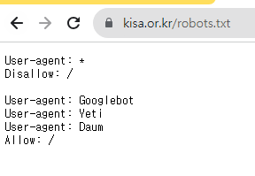
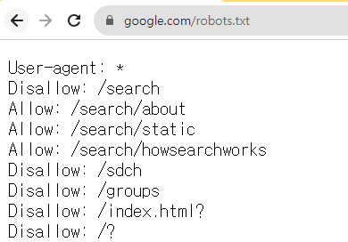

# 검색엔진 정보 노출 취약점

* 검색엔진에 의해 웹 사이트 해킹에 필요한 정보(시스템 정보, 개인 정보 등)가 검색되어 해킹의 빌미가 제공되는 취약점을 말한다.
* 검색엔진의 성능 향상에 따라 HTML 웹페이지 내용뿐만 아니라 PDF, 엑셀, 한글, 워드 등 서버에 저장된 문서파일의 내용까지 검색하여 의도하지 않은 주소록, 회원 정보 등의 개인정보 파일이 노출되는 위험성이 증가한다.
* `로봇배제표준`은 검색 로봇에 대한 웹 사이트의 디렉터리 및 파일들에 대한 검색 조건을 명시해놓은 국제 규약으로 접근 제한에 대한 설정을 `robots.txt`파일에 기술한다.
* 검색로봇이란 검색엔진이 검색 데이터베이스의 내용을 보충하기 위해 웹 사이트를 검색하여 정보를 가져오는 프로그램을 말한다. 일반적인 검색로봇은 사이트 방문 시 가장 먼저 웹사이트의 로봇배제 표준 설정 파일을 확인하고 이를 준수하여 컨텐츠를 수집한다.
  * 로봇 배제 표준은 방지 기술이 아닌 검색로봇 운영자 간의 약속이므로 악의적인 검색엔진의 경우 이를 무시하고 컨텐츠를 수집할 수 있다.
  * 주요 검색엔진 및 검색 로봇 명을 살펴보면 구글의 Googlebot, 네이버의 naverbot, yeti 등이 있다.

***

## robots.txt. 설정 방법

* robots.txt 파일의 내용은 크게 로봇의 이름을 적는 부분(User-agent)과 URL의 접근허용 여부를 적는 부분(Allow/Disallow)으로 구분된다.
* robots.txt 파일은 반드시 웹 사이트의 최상위 주소(루트 디렉터리)에 저장해야한다. 하위 디렉터리에 저장할 경우 효력이 없다.
  * 예를 들어, http://www.ehdcjf.com 웹 사이트에 검색엔진 접근을 제어하려면 robots.txt 파일이 http://ehdcjf.com/robots.txt에 위치해야한다.

| robots.txt                                                                                       | 허용/차단 내용                                                                                                                                                               |
| ------------------------------------------------------------------------------------------------ | ---------------------------------------------------------------------------------------------------------------------------------------------------------------------- |
| 
User-agent:* Disallow:/
                                                                | 모든 검색로봇(\*)에 대해 웹 사이트 전체에 대한 접근(크롤링)을 차단한다.                                                                                                                            |
| 
User-agment:Googlebot User-agent:Yeti Disallow (또는 Allow:/)
                      | 
• Googlebot, Yeti 검색 로봇에 대해 웹 사이트 전체에 대한 접근을 허용한다. • Disallow 항목에 아무것도 명시하지 않으면 웹 사이트 전체 허용을 의미하며 <code>Allow: /</code>와 동일한 의미이다.
                           |
| 
User-agent:* Disallow: /cgi-bin/ Disallow: /private/
                                | 
• 모든 검색로봇에 대해 cgi-bin, private 디렉터리에 대한 접근을 차단한다.(디렉터리 참조시 <code>/</code> 로 끝나야함.) • 만약 /private으로 지정했다면 /private로 시작하는 경로(디렉터리 및 파일)에 대해 차단한다.
              |
| 
User-agent: Yeti Disallow: /private/private_file.html
                                  | Yeti 검색로봇에 대해 /private/private\_file.html 페이지 접근을 차단한다.                                                                                                                |
| 
User-agent:Googlebot-image Disallow: /admin/ Disallow: /*.pdf$ Disallow: /*.gif$
 | 
• Googlebot-image 검색로봇에 대해 admin 디렉터리에 대한 접근을 차단한다. • Googlebot-image 검색로봇에 대해 모든 pdf 파일에 대한 접근을 차단한다. • Googlebot-image 검색로봇에 대해 모든 gif 파일에 대한 접근을 차단한다.
 |

## robots.txt 작성 시 유의 사항

* 설정파일명은 반드시 `robots.txt`이어야 하며 파일 위치는 웹 사이트의 최상위 디렉터리(/)이어야 한다.
* 대소문자를 구분한다.
* 띄어쓰기에 유의해야한다. `User-agent`, `Allow`, `Disallow` 와 콜론은 붙어있어야 하며 콜론(:) 이후에는 공백이 추가된다.

## 예

* 모든 검색로봇에 대해 웹 사이트 전체에 대한 접근을 허용하고 있다.

\
\
\

* 모든 검색로봇에 대해 /search로 시작하는 경로(디렉터리 또는 파일)의 접근을 차단하되 /search/about 및 /search/howseaechworks 로 시작하는 경로(디렉터리 또는 파일)는 모두 허용하고 있다.
* 허용 예) /search/about, /search/about.html, /search/about/abc.html
* 차단 예) /search, /search.html, /search/abc.html
